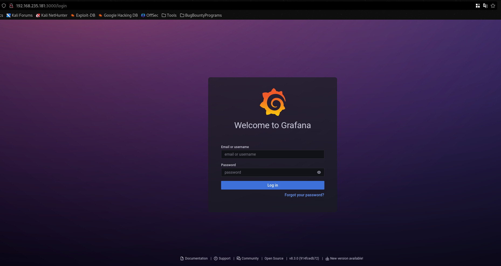
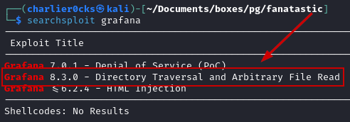
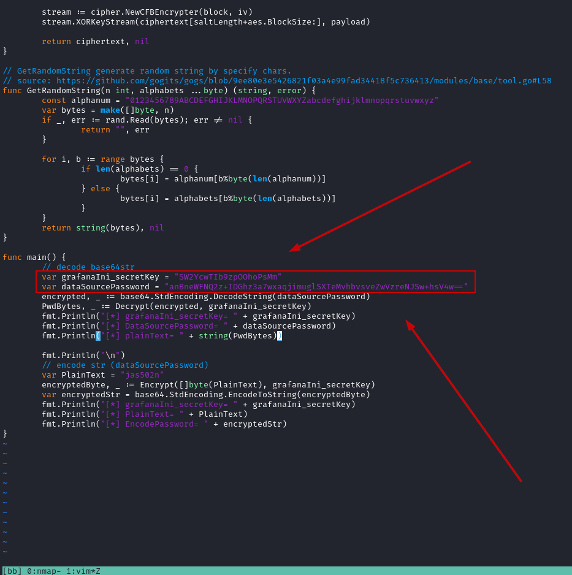
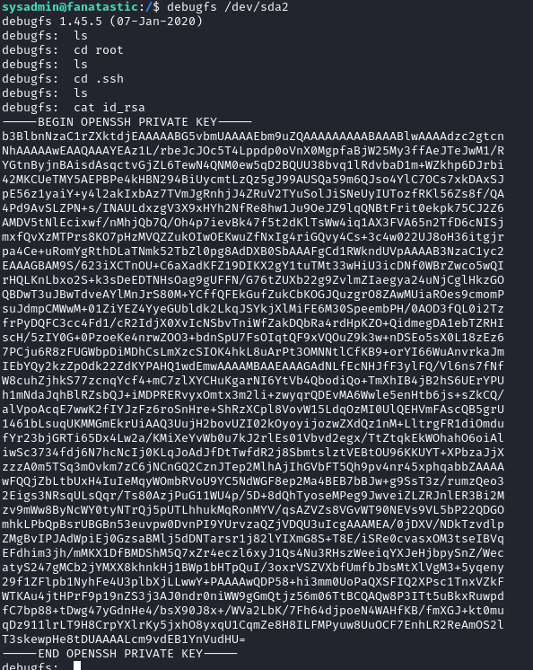
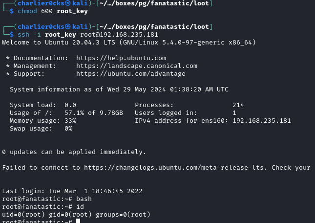

 **IP: 192.168.235.181**
# Recon
## Nmap

`nmap` found three ports open, SSH (22), HTTP (9090), and HTTP (3000).

```bash
nmap -Pn -T4 -sVC -p 22,3000,9090 192.168.235.181 -oA fanatastic

PORT     STATE SERVICE VERSION                                                                                                                                                                                                                                                                                              
22/tcp   open  ssh     OpenSSH 8.2p1 Ubuntu 4ubuntu0.4 (Ubuntu Linux; protocol 2.0)                                                                                                                                                                                                                                         
| ssh-hostkey:                                                            
|   3072 c1:99:4b:95:22:25:ed:0f:85:20:d3:63:b4:48:bb:cf (RSA)            
|   256 0f:44:8b:ad:ad:95:b8:22:6a:f0:36:ac:19:d0:0e:f3 (ECDSA)           
|_  256 32:e1:2a:6c:cc:7c:e6:3e:23:f4:80:8d:33:ce:9b:3a (ED25519)         
3000/tcp open  ppp?                                                       
| fingerprint-strings:                                                    
|   FourOhFourRequest:                                                    
|     HTTP/1.0 302 Found                                                  
|     Cache-Control: no-cache                                             
|     Content-Type: text/html; charset=utf-8                              
|     Expires: -1                                                         
|     Location: /login                                                    
|     Pragma: no-cache                                                    
|     Set-Cookie: redirect_to=%2Fnice%2520ports%252C%2FTri%256Eity.txt%252ebak; Path=/; HttpOnly; SameSite=Lax
|     X-Content-Type-Options: nosniff                                     
|     X-Frame-Options: deny                                               
|     X-Xss-Protection: 1; mode=block                                     
|     Date: Tue, 28 May 2024 21:04:56 GMT                                 
|     Content-Length: 29                                                  
|     href="/login">Found</a>.                                            
|   GenericLines, Help, Kerberos, RTSPRequest, SSLSessionReq, TLSSessionReq, TerminalServerCookie: 
|     HTTP/1.1 400 Bad Request                                            
|     Content-Type: text/plain; charset=utf-8                             
|     Connection: close                                                   
|     Request                                                             
|   GetRequest:                                                           
|     HTTP/1.0 302 Found                                                  
|     Cache-Control: no-cache                                             
|     Content-Type: text/html; charset=utf-8                              
|     Expires: -1                                                         
|     Location: /login                                                    
|     Pragma: no-cache                                                    
|     Set-Cookie: redirect_to=%2F; Path=/; HttpOnly; SameSite=Lax         
|     X-Content-Type-Options: nosniff                                     
|     X-Frame-Options: deny                                               
|     X-Xss-Protection: 1; mode=block                                     
|     Date: Tue, 28 May 2024 21:04:25 GMT
|     Content-Length: 29                               
|     href="/login">Found</a>.
|   HTTPOptions:                                                                                                                                              
|     HTTP/1.0 302 Found                                     
|     Cache-Control: no-cache
|     Expires: -1                                     
|     Location: /login
|     Pragma: no-cache
|     Set-Cookie: redirect_to=%2F; Path=/; HttpOnly; SameSite=Lax
|     X-Content-Type-Options: nosniff
|     X-Frame-Options: deny
|     X-Xss-Protection: 1; mode=block
|     Date: Tue, 28 May 2024 21:04:30 GMT
|_    Content-Length: 0
9090/tcp open  http    Golang net/http server (Go-IPFS json-rpc or InfluxDB API)
| http-title: Prometheus Time Series Collection and Processing Server
|_Requested resource was /graph

```

## Web Application - TCP 3000
### Site

Visiting the site on port 3000 takes us to a login page that runs Grafana, which is an open source analytics and interactive visualization web application.



In the footer of this site, we can see version disclosure and a hint that this software is currently outdated.


# Shell as sysadmin
## CVE-2021-43798
### Identify

Doing some research, as well as using a tool called `searchsploit`, reveals an arbitrary file read and directory traversal vulnerability for this version of Grafana.



### Execute

I will be using an exploit script written in Python created by `pedrohavay`: [exploit-grafana-CVE-2021-43798](https://github.com/pedrohavay/exploit-grafana-CVE-2021-43798)


We retrieved a secret key: `SW2YcwTIb9zpOOhoPsMm`

### Analyzing Files

After countless amount of minutes, this is what I was doing:
- Viewing SQLite db file to find credentials. Found hashed credentials in table `user` for the user `admin`.
- Researched possible ways to crack this hash but since it was salted, it seemed unlikely to crack this hash.
- Going through the other files that we extracted, but could not find anything useful.

Finally, I ended up using `grep` to extract the keyword `pass` and found an interesting string within the `grafana.db` file.


It seems to be an encoded password for either the user `prometheus` or `sysadmin` (We found sysadmin as a user in the extracted passwd file using the CVE).

My first instinct was to `base64 -d` this string as it looked to be base64.


Unfortunately, using this decoded string did not allow us to authenticate via SSH for both users, as that's what I tried the moment I got the decoded string.

I took a step back, and researched deeper into this secret key extracted from the grafana.ini file.
### Decrypting Password

After many minutes of researching, I find a different [Github repo](https://github.com/jas502n/Grafana-CVE-2021-43798/blob/main/README.md) that talks about decrypting and encrypting passwords using this secret key. 

We grab the go script named `AESDecrypt.go` and tweak the password to the one we found. The secret key we can leave alone as the one we found is the default secret key.



Then we go ahead and run the script:

```go
go init AESDecrypt.go
go init tidy
go run AESDecrypt.go
```


We found that this password works with the user `sysadmin` via SSH.


# Shell as root
## Disk Group

We find that the user `sysadmin` is part of the `Disk` group.

```
uid=1001(sysadmin) gid=1001(sysadmin) groups=1001(sysadmin),6(disk)
```

This is what the [HackTricks site](https://book.hacktricks.xyz/linux-hardening/privilege-escalation/interesting-groups-linux-pe#disk-group) tells us about the `Disk` group:

```
Disk Group

This privilege is almost equivalent to root access as you can access all the data inside of the machine.

Files:/dev/sd[a-z][1-9]

df -h #Find where "/" is mounted
debugfs /dev/sda1
debugfs: cd /root
debugfs: ls
debugfs: cat /root/.ssh/id_rsa
debugfs: cat /etc/shadow

Note that using debugfs you can also write files. For example to copy /tmp/asd1.txt to /tmp/asd2.txt you can do:

debugfs -w /dev/sda1
debugfs:  dump /tmp/asd1.txt /tmp/asd2.txt

However, if you try to write files owned by root (like /etc/shadow or /etc/passwd) you will have a "Permission denied" error.
```

With this information, we first verify where the `/` is mounted -> /dev/sda2.
Then we use `debugfs` to access that filesystem.


We can now view the contents of the root user's home directory and dump the SSH key.



We can copy the contents of this key to SSH into root. 




---
# References

- HackTricks: Disk Group - https://book.hacktricks.xyz/linux-hardening/privilege-escalation/interesting-groups-linux-pe#disk-group
- GitHub repo: DecryptAES - https://github.com/jas502n/Grafana-CVE-2021-43798/blob/main/README.md
- GitHub repo: CVE - https://github.com/pedrohavay/exploit-grafana-CVE-2021-43798